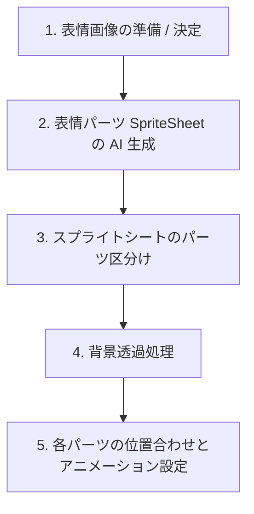

# AI生成パーツによる表情アニメーション作成ワークフローの実装計画

目と口のアニメーションパーツを AI (Gemini 等の画像生成 AI) で直接スプライトシートとして生成し、それをスライス（区分け）して背景を透過し、最終的に位置調整を行ってアニメーションに組み込む新しいワークフローを提案します。

## 概要と現行方式からの変更点

従来の方式では、全身画像または顔全体の表情差分画像から「のっぺらぼう」画像との差分（XOR）を計算して目・口パーツを切り出していました。
この方法では、生成画像のわずかなアライメントのズレや髪の毛の干渉によるノイズ（ボロボロ化）が発生しやすい課題がありました。

新方式では、以下のプロセスを辿ります：
1. **表情画像（キャラクター）の決定**
2. **表情パーツ SpriteSheet の AI 生成**
   - 目4コマ（両目、open / half open 1 / half open 2 / close）
   - 口4コマ（open / half open 1 / half open 2 / close）
   - 上記が1つの画像（SpriteSheet）に収まった画像をAIで生成。
3. **パーツ区分け (Slice)**
   - 生成されたスプライトシートから、目4コマ、口4コマの計8つのパーツ領域を矩形で検出・スライス。
4. **背景削除 (Remove Background)**
   - 各パーツ画像の背景色（顔の肌色など）をクロマキーまたは輪郭抽出で透過処理。
5. **パーツの位置調整 & アニメーション設定 (Alignment & Preview)**
   - 透過処理されたパーツを、ベースの「のっぺらぼう」画像に重ね合わせ、プレビューを見ながら位置調整を行う。

---

## 提案するワークフロー詳細

### 1. 表情画像の準備 / 決定
ベースとなる表情（通常、喜び、怒り、悲しみなど）とキャラクターの顔デザインを決定します。

### 2. 表情パーツ SpriteSheet の AI 生成
* プロンプト `gemini_eye_mouth_parts_prompt.txt` に従って、目4コマ、口4コマが並んだ SpriteSheet 画像をAIで生成します。
* テストとして配置されている `gemini_eye_mouth_parts_喜び.png` などのアセットを使用、またはエディタ内からAI生成APIを叩いて生成します。

### 3. パーツ区分け (Slice)
* スプライトシート画像を画像処理（Python サービス）で解析し、各パーツ（目4枚、口4枚）の矩形（Bounding Box）を自動検出します。
* 検出アルゴリズム案：
  1. グレースケール化および二値化
  2. 輪郭（Contours）の検出
  3. 各輪郭を囲む最小外接矩形を算出し、一定のサイズ以上のものをパーツ候補として抽出
  4. グリッド配置（例: 上段に目4コマ、下段に口4コマなど）を想定し、左から右、上から下へソートしてインデックスを割り当てる。

### 4. 背景削除 (Remove Background)
* AI生成パーツの背景（肌色）を透明化します。
* アルゴリズム案：
  * **背景色サンプリングによるクロマキー透過**: パーツ矩形の端（例：左上ピクセルなど）の色を背景色（肌色）と仮定し、カラーディスタンスが一定閾値以下のピクセルをアルファ値0（透明）にする。
  * **外郭輪郭ベースの切り抜き**: パーツのパーツ実体（瞳や眉、口の線）の輪郭を抽出し、その内部のみを残して透過PNGにする。

### 5. パーツの位置調整 & アニメーション設定
* 切り出された透過パーツ（目4枚、口4枚）を、元の「のっぺらぼう」画像の顔の適切な位置へ配置します。
* ユーザーはフロントエンド（Vue画面）上で、目と口の基準位置（`offsetX`, `offsetY`）をスライダーやドラッグ操作で調整します。
* 4コマのアニメーションをその場でプレビュー再生（瞬き・口パク）し、各コマのズレがないか確認・微調整します。
* 調整が完了したら、テクスチャアトラス（`atlas.png`, `atlas.json`）としてパッキングし保存します。

---

## 修正・新規作成が必要なコンポーネント案

### バックエンド (Python Services)
* **[NEW] slice_and_transparent_parts.py** (新規作成予定)
  - 入力：SpriteSheet画像
  - 処理：パーツ矩形の自動検出（スライス） ＋ 背景色透過処理 ＋ 透過PNGとしての保存
  - 出力：切り分けられた目4枚、口4枚の画像パスとそれぞれのメタデータ座標

### フロントエンド (Vue / Electron)
* **[MODIFY] ExpressionEditor.vue** (修正予定)
  - UIステップの変更（旧：XOR差分による切り出し -> 新：AI生成SpriteSheetからのスライス・背景透過・位置調整）
  - AI生成パーツスロットのアップロード/生成プレビュー機能の追加
  - パーツごとの手動位置微調整UIの強化

---

## ユーザー確認・検討事項

> [!IMPORTANT]
> 1. **スプライトシートのグリッド/レイアウトの前提ルール**
>    AIが生成するスプライトシートにおける目と口の並び順について、どのようなルール（例：「上段に左から右へ目のOpen→Closedが4枚、下段に口のOpen→Closedが4枚」など）を前提とするか、あるいはユーザーが手動で「どれが目のOpenか」などをドラッグ＆ドロップでアサインし直せるUIにするべきか。
> 2. **背景透過処理の許容度**
>    AI生成されたパーツの背景（肌色）の透明化において、肌色と白目（あるいはハイライト）の境界が曖昧な場合、透過の閾値調整が必要になる可能性があります。エディタ上に「透過しきい値」のスライダーを設ける設計が望ましいでしょうか。

## 検証計画
- `slice_and_transparent_parts.py` を作成し、`tickets/expression-editor-redesign/` 配下のテスト用PNG画像を用いてスライス・透過処理が正確に行えるか単体テストで検証する。
- フロントエンドに透過済みのスライスパーツを読み込み、のっぺらぼう画像上で正しく重ね合わせ・調整ができることを確認する。
